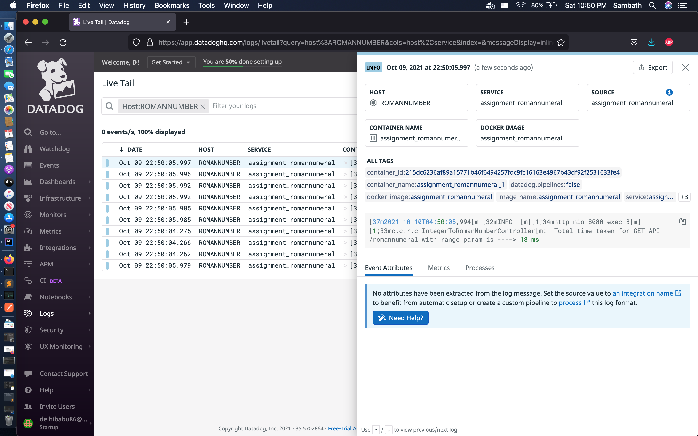

# romannumeral
MicroService Architecture - Spring Boot Application exposing GET API.Converts integer into roman numeral.

API Contract & Design : http://localhost:8080/swagger-ui/index.html

##Pre-requisites

* Install Java 15 - https://jdk.java.net/archive/
* Install maven - https://maven.apache.org/download.cgi
* Install docker - https://docs.docker.com/get-docker/
* Execute java -version on terminal & make sure jdk15 is the version
* Execute mvn --version on terminal
* Install docker and ensure its up & running on the machine
* IDE (IntelliJ or Eclipse)

## Summary

- [How to build & run project](#how-to-build--run-project-)
- [Application Architecture](#application-architecture)
- [Development Stack](#development-stack)
- [Test Stack](#test-stack)
- [Monitoring & Metrics Tools](#monitoring--metrics-stack)
- [Project Structure](#project-structure)
- [Dependency Tree](#dependency-tree)  
- [API samples](#api-samples)
- [Testing](#testing)
- [Tools Enablement](#tools-enablement)
- [References](#references)
- [Enhancements](#enhancements)

## How to build & run project ?

* Clone the git repo - https://github.com/delhibabu86/feature-romannumeral.git
* cd feature-romannumeral
* Execute mvn clean install on the project root folder.Ensure its completed successfully.
* maven build will fail if Unit Test Code coverage is less than 95%

## Run with docker

* Start docker compose : docker-compose up --build --force-recreate
* Ensure all services are up : docker-compose ps
* Wait for a minute or two to ensure all containers are up & healthy

* If needed to stop docker container run below command
  
    docker container ps
  
    docker stop containerId

* Validate below services are up & running 

* SpringBoot & swagger end point are implemented with Basic Authentication.

* User Credentials can be accessed from application properties #spring-security config

* Spring Boot Roman Numeral App - http://localhost:8080/romannumeral?query=452
* Swagger UI(API documentation ) - http://localhost:8080/swagger-ui/index.html
* Sonar Qube - http://localhost:9000 .Credentials : admin/admin is the default credential
* Datadog - https://www.datadoghq.com/

## High Level Architecture

## Development Stack

* Java 15
* spring-boot 2.5.5
* spring-security  
* Maven 3.8.2
* Swagger 
* Docker
* Docker Compose

## Test Stack

* Junit5
* Mockito
* SpringBootTest
* sonarqube

## Monitoring & Metrics Stack

* Actuator enabling prometheus
* Datadog for both log aggregation & system metrics

## Project Structure

## Dependency Tree

## API samples

GET API via curl

GET API via swagger

## Testing

Unit Test Result from Jacoco plugin site :

Unit Test Result from sonarqube :

Integration Test results from Intellij Jacoco plugin :

## Tools Enablement/Setup

#SonarQube 

Please look into SonarQube_setup.pdf under assets folder

# DataDog

Log into https://app.datadoghq.com with dlearnvb86@gmail.com/learn2fun

Select Logs on left side of menu .
* Below shows logs aggregation on data dog

Select metrics on left side of menu
* Below shows metrics dashboard from datadog

## References

* Roman Numerals - https://en.wikipedia.org/wiki/Roman_numerals
* Datadog setup - https://docs.datadoghq.com/
* sonar qube - https://docs.sonarqube.org/latest/
* jacoco plugin - https://www.eclemma.org/jacoco/trunk/doc/maven.html
* Actuator prometheus setup with datadog - https://docs.spring.io/spring-boot/docs/current/reference/htmlsingle/#actuator.metrics
* Swagger-ui - https://swagger.io/tools/swagger-ui/
* Docker Compose - https://docs.docker.com/compose/
* Spring boot - https://spring.io/projects/spring-boot

## Enhancements
* Implement spring-sleuth to enable log trace across microservices
* Implement JWT for api security
* Implement integration testing with jacoco for code coverage
* Setup alerts on datadog
* Performance testing using jmeter or locust or other tools
* Implement the project with kubernetes

